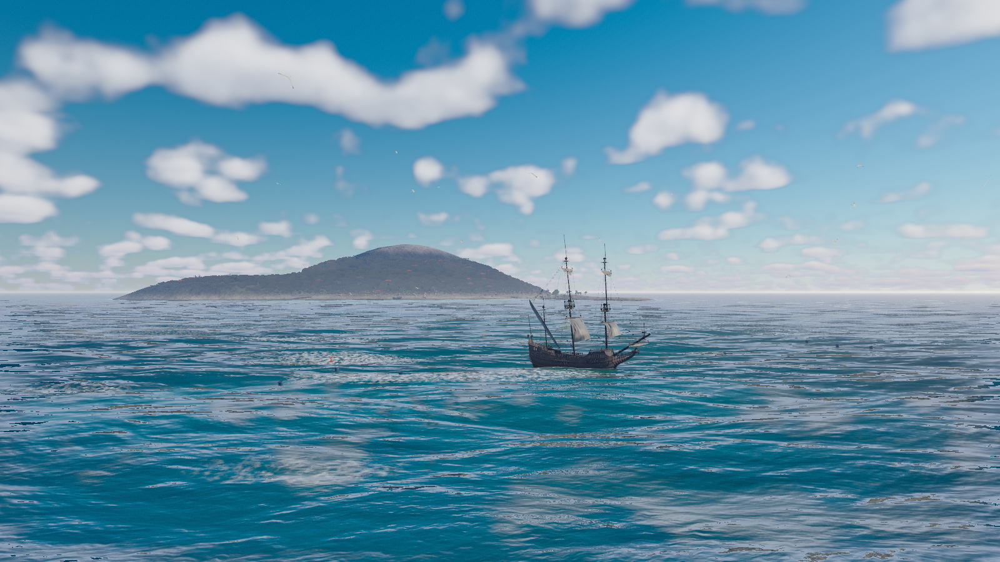
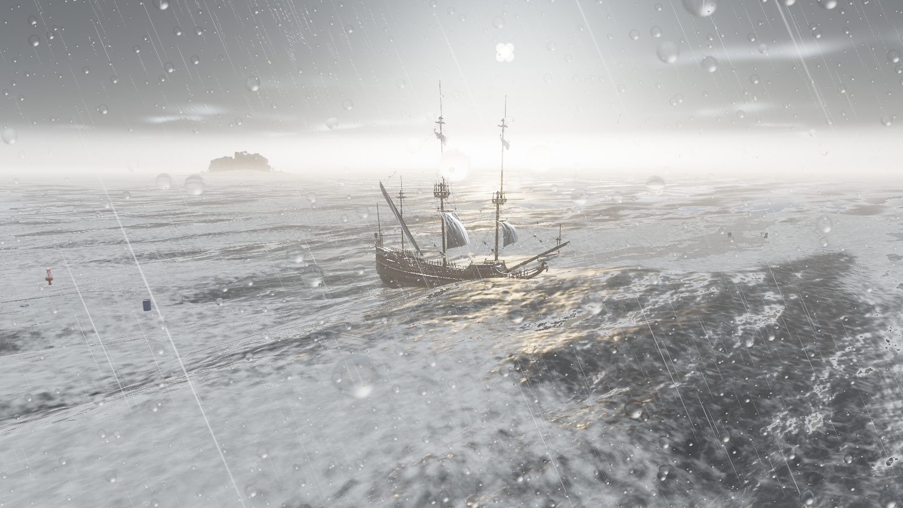
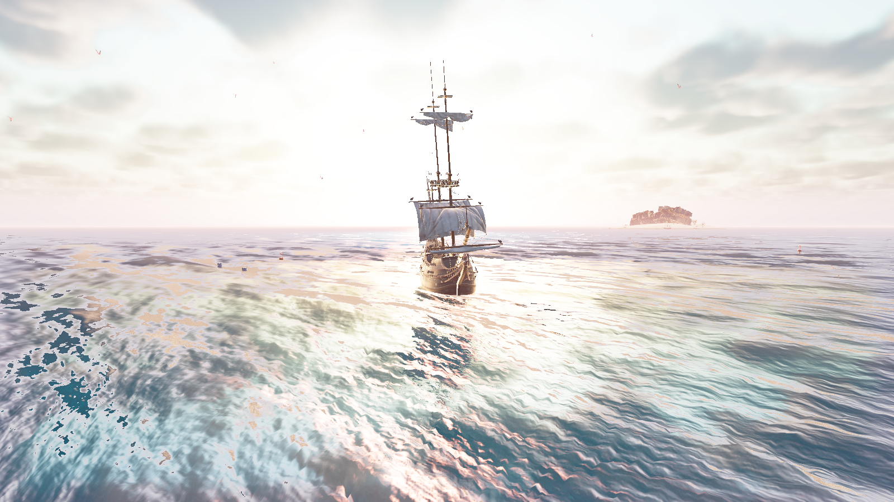
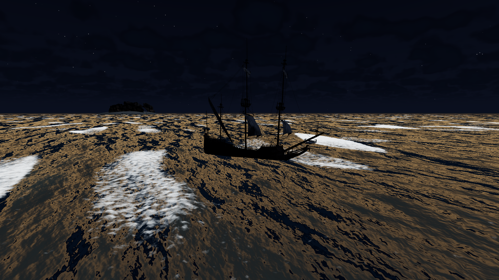
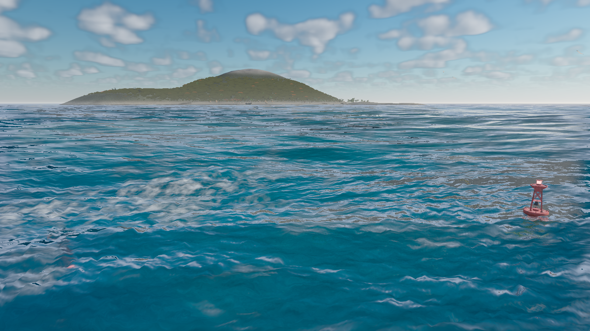
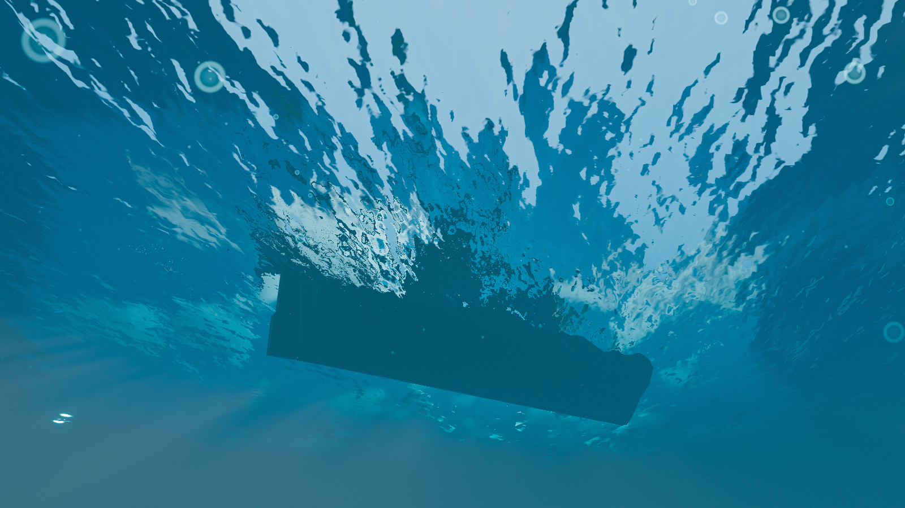
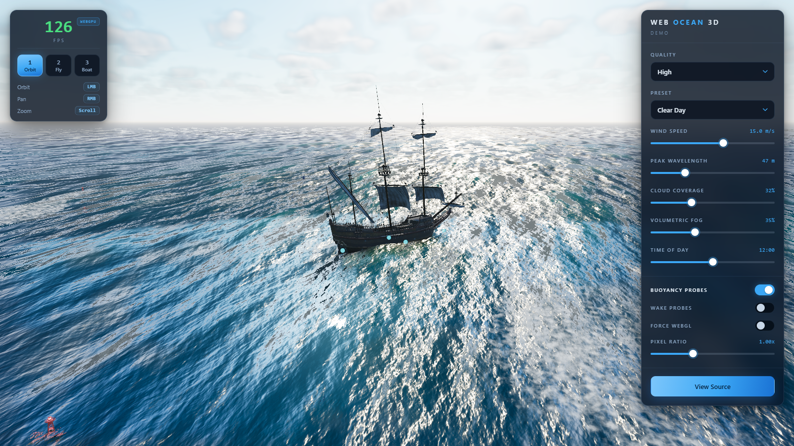

# Web Ocean 3D

A realtime spectral ocean rendered with **Three.js**, **WebGPU** and **TSL** — FFT wave
synthesis, physically motivated water optics, foam, caustics, buoyancy, wakes, underwater
transitions and a volumetric sky, with a graceful WebGL2 fallback from the same shader source.



<p align="center">
  
  
  
  
  
</p>

---

## Quick start

```bash
npm install
npm run dev            # http://127.0.0.1:5173
```

```bash
npm run build          # typecheck + production bundle
npm run preview        # http://127.0.0.1:4173
npm test               # Playwright suite (starts its own preview server)
```

Assets are committed, but the set is reproducible from scratch:

```bash
node scripts/fetch-assets.mjs             # idempotent
node scripts/fetch-assets.mjs --force     # re-fetch everything
node scripts/fetch-assets.mjs --verify    # offline integrity check
```

**Requirements** — Node 20+, and a browser with WebGPU for the full experience
(Chrome/Edge 113+, Safari 18+). Without it the app falls back to WebGL2 automatically; the
**Force WebGL** switch exercises that path deliberately.

---

## Gallery

Nine environment presets. Each moves the sun, sea state, water optics, aerial perspective
and weather together — so switching reads as a different *place*, not a colour filter.

| Clear Day | Storm |
|---|---|
|  |  |
| Cumulus, 15 m/s wind, turquoise shallows | 21 m/s, overcast deck, rain, heavy chop |

| Sunset | Moonlit |
|---|---|
|  |  |
| Low sun, warm haze, near-glassy swell | Sun below horizon, star field, long swell |

| Wave detail | Underwater |
|---|---|
|  |  |
| Jacobian-driven whitecaps at 19 m/s | Hull from below, particulates, caustics |



*The control panel and HUD. Buoyancy probes are switched on here, showing the four hull
sample points the physics solves against.*

> Gallery shots are captured with the UI hidden. The FPS readout is omitted from the
> interface shot on purpose — see [Performance](#performance) for why a frame-rate number
> captured under browser automation would be meaningless.

---

## Controls

| | |
|---|---|
| **1 / 2 / 3** | Orbit / Fly / Boat camera |
| **Orbit** | LMB drag rotate · RMB drag pan · scroll zoom |
| **Fly** | click to capture the mouse · WASD · Space/Ctrl up-down · Shift boost |
| **Boat** | **W/S** throttle ahead and astern · **A/D** rudder · chase camera follows the hull |
| **Touch** | Boat mode on a touch device gets an on-screen stick: forward for ahead, back for astern, left and right for rudder |

Boat mode selects the ship, not just a camera. Leaving it releases ship input, so Orbit and
Fly keep their own keys. The rudder is a foil: it has little authority until the ship has way
on, and it reverses when making sternway.

Drop the camera below the surface in any mode to trigger the underwater state.

---

## Features

**Ocean**
- Depth-aware refraction: the scene behind the surface, distorted by the wave normal, with
  the water column measured from the depth buffer and Beer–Lambert absorption over it
- Full microfacet BRDF — GGX distribution, height-correlated Smith visibility and Fresnel on
  the half-vector — with an **anisotropic** lobe whose along/across roughness ratio comes from
  Cox & Munk's measured slope variances, so the sun track stretches toward the viewer
- Geometric specular antialiasing, which is what keeps a lobe this narrow from spiking on the
  one wave face that happens to line the half-vector up
- **Snell's window and total internal reflection** on the underside: the whole sky compressed
  into a 48.6-degree disc, the underwater scene mirrored around it
- Planar reflection of ship, props and clouds, sampled at a roughness- and distance-driven mip
  level rather than as a mirror, faded out at the frame edge and at grazing angles
- Persistent foam: breaking crests and the ship's wake deposit into one world-anchored buffer
  that decays over seconds, rather than a mask recomputed every frame
- JONSWAP directional spectrum with live wind-speed and peak-wavelength control
- Three spectral cascades (512 m / 128 m / 16 m tiles) — swell, chop and ripple with no
  visible tiling
- Jacobian-derived whitecaps: foam appears where the surface genuinely folds, biased toward
  crests and broken up with world-space noise
- Fresnel sky reflection, Beer–Lambert transmission, subsurface scattering on backlit
  crests, GGX sun specular
- Shallow-water tint driven by real seafloor depth

**World**
- Steerable sailing ship: throttle and rudder resolved into forces the buoyancy solver
  integrates, so propulsion composes with heave, pitch and roll instead of overriding them
- Kelvin wake that *deforms* the water, not just foams it: the transverse and divergent wave
  systems and a bow wave, with `k = g/V²` so the crests lengthen as the square of speed
- Rain wets what it lands on — wood and canvas darken and gloss in a squall, and stay damp for
  half a minute after it passes
- Cloud shadows drift across the water, sampled from the same density field the clouds are
  drawn from
- Buoys and barrels floating independently
- Procedural seafloor with animated caustics; island silhouette
- Preetham-model sky with raymarched volumetric clouds, stars, moon, rain and snow

**Underwater**
- **A per-pixel waterline.** The medium is integrated over the segment of *each eye ray* that
  lies below the surface, with the surface taken from the wave field where the ray meets it —
  so air and water appear in the same frame and the line follows the crests
- Per-channel extinction, drifting particulates and bubble columns
- God rays marched in *world* space against the caustics field, so the shafts and the pattern
  they cast on the seafloor are one evaluation of one field rather than two effects tuned to
  resemble each other
- Continuous cross-fade across the waterline rather than a hard cut, and the camera crosses it
  freely in either direction

**Engineering**
- Volumetric height fog with per-preset extinction and a live density control
- Five quality tiers plus adaptive downgrade under sustained load
- Live pixel-ratio control
- Deterministic test hooks for automated verification

---

## Architecture

```
src/
  core/        renderer bootstrap + fallback, frame loop, quality tiers
  ocean/       spectrum, FFT, simulation, mesh, surface shading, CPU sampler
  sky/         atmosphere, volumetric clouds, weather
  underwater/  fog and god rays, particulates, caustics
  scene/       asset loading, ship, props, seafloor
  physics/     buoyancy, wake accumulation
  cameras/     orbit / fly / boat director
  ui/          control panel, HUD (framework-free DOM)
  presets/     nine environment definitions
```

### Design decisions worth explaining

**One shader source, two backends.** Three's `WebGPURenderer` compiles the same TSL node
graph to WGSL or GLSL, so the WebGL2 fallback is a configuration flag rather than a parallel
codebase.

**FFT waves, not a Gerstner sum.** A Gerstner sum needs hundreds of waves before it stops
looking periodic. An FFT gives a full directional spectrum at fixed cost and — more usefully
— yields the *Jacobian* of the displacement map, which is physically where whitecaps form.
Foam is therefore derived, not painted.

**The IFFT runs as fragment passes, not compute.** Three's WebGL2 backend has neither compute
shaders nor storage textures, so a compute implementation would need a separate fallback
path. At our sizes the transform is not the bottleneck; surface shading is.

**Geometry LOD and shading LOD are separate curves.** Vertex spacing on the radial ocean grid
grows with radius, so a cascade must stop *displacing* geometry well before it stops
contributing *normals*. Conflating the two is what makes naive ocean meshes sparkle — every
triangle lands on a random phase of a wave it cannot resolve. Geometry flattens with distance
while mipmapped derivative textures carry fine detail to the horizon.

**Buoyancy reads back asynchronously.** A small slice of the displacement field is copied to
host memory without awaiting the GPU fence. One frame of staleness on a floating hull is
invisible; a pipeline stall is not.

---

## Verification

Two suites. The functional one asserts behaviour; the visual one compares seven canonical shots
against checked-in baselines with a CIE94 ΔE metric whose thresholds come from a *measured*
run-to-run noise floor — not pixel-exact equality, which no GPU render can hold to. Notable
checks:

- Sea state read straight off the GPU: crest amplitude in metres, no non-finite values,
  whitecap coverage under 8%
- Boot on both backends with zero console errors
- Presets must each change the image and not collapse to one look
- Texture and geometry counts across repeated quality cycles, to catch leaks
- Layout overflow from 360 px to 1920 px

**Measured numbers**, read off the GPU rather than judged by eye:

| Quantity | Measured | Source |
|---|---|---|
| Folded surface area (J < 0), cascade 0 at 15 m/s | **3.8%** | `produces a physically plausible sea state` (gate: `< 8%`) |
| Crest amplitude, cascade 0 | **±1.4 m** | same (gate: `0.4 m … 12 m`) |
| Surface below the break threshold (J < 0.14) | **5.5%** | one-off histogram of the Jacobian readback; drives the deposit rate |

> This table previously quoted "whitecap coverage 4.6%, asserted by
> `produces a physically plausible sea state`". That test reads displacement
> Jacobians and asserts only `foldedPercent < 8`; it never reads the foam buffer
> and never measures rendered whitecap coverage. The figure was a plausible number
> attached to the wrong source, which is exactly what
> [`docs/CLAIMS_AUDIT.md`](docs/CLAIMS_AUDIT.md) exists to catch. Removed.

> An earlier revision of this table also quoted a buoyancy/wave-slope correlation,
> a seafloor CPU/GPU agreement figure, a wake spread angle and a sky zenith
> colour. No assertion in the suite produced any of them, so they have been
> removed rather than left standing as unsourced numbers. See
> [`docs/CLAIMS_AUDIT.md`](docs/CLAIMS_AUDIT.md).

Bugs found by measuring rather than looking, none of them visible to typecheck:

1. The FFT butterfly twiddle exponent used the group width where it needed the half-span,
   applying `W^(N/2) = -1` to every odd row at stage 0.
2. Geometry and shading shared one LOD curve, undersampling the wave field into speckle.
3. The volumetric fog and underwater passes built their view ray with NDC y taken straight
   from a top-down screen uv, so every ray's vertical component was inverted. It read as fog
   rather than as a broken ray: the sky integrated the whole height-fog column and every
   preset rendered as a white-out. The tell was that it did not respond to density — a 175×
   sweep of the slider produced the same white, because both ends were saturated.
4. The panel placed its sliders by array index, so inserting two controls pushed the last two
   off the end. They were declared, had labels and formatters, and were never built.
5. A helper introduced to *fix* undefined reversed-edge `smoothstep` had its own edges the
   wrong way round and returned a constant zero. It was caught by a new test asserting the
   effect was visible at all, which is the argument for having one per effect.

---

## Performance

Frame work measures **1.00 / 3.13 / 6.49 ms** GPU p50 at Low / High / Max on WebGPU at
1600 × 900 DPR 1, against a 16.7 ms budget. WebGL2 Low measures **2.58 ms** against 33.3 ms.
All seven benchmarked configurations pass, with no console errors during the sample.

**Read that with care.** Automated Chromium throttles `requestAnimationFrame` independently
of load — this project measured 1.1 "FPS" while spending 0.8 ms per frame, and the same
~1 fps appears with every effect disabled. The test suite therefore gates on per-frame *work*
(16.7 ms WebGPU, 33.3 ms WebGL) and only asserts frame rate when the browser is demonstrably
not throttling. `frameMs` is also wall-clock around the render call, and WebGPU submits work
asynchronously, so it **undercounts true GPU time**.

Full methodology, cost model and the honest list of what remains unmeasured:
[`docs/PERFORMANCE.md`](docs/PERFORMANCE.md).

---

## Known limitations

- **No temporal antialiasing or reconstruction.** Every stochastic effect here — the fog march,
  the cloud march, the shaft march, the specular lobe — resolves spatially within one frame.
  This is the largest single thing between the current image and a shipping one: it is what
  would stabilise the glitter and let every march trade samples for frames.
- **Screen-space reflection is full-resolution, single-ray and non-temporal.** It cannot
  reconstruct off-screen content or a rough lobe. The *planar* layer is now sampled at a
  roughness-driven mip level, so the composite is no longer a mirror, but there is still no
  prefiltered probe and no stochastic sampling with a temporal resolve.
- **Specular antialiasing is the geometric variant, not slope-space NDF filtering.** It adds
  the scalar magnitude of the shading normal's screen-space derivatives to `alpha²`, which
  discards the anisotropic covariance — so it cannot know that a pixel's normal varies more
  along the wind than across it, which for this surface is the interesting part. Residual
  striping in the near field is the honest consequence.
- **The grazing reflection fade is art-directed, not a Smith term.** It bottoms out at 0.45
  where a real masking function goes to zero, and it multiplies the Fresnel blend rather than
  acting as the BRDF's geometry factor. (The *specular* Smith visibility is a real
  height-correlated anisotropic term; this is a separate, cruder fade on the environment
  reflection.) See `GRAZING_SLOPE_SIGMA`.
- **Refraction is a normal-driven UV offset, not a refracted ray.** Snell's law is not solved
  and the offset ray is not intersected with scene geometry; the depth read that follows it is
  real, and drives real absorption, but the displacement itself is an approximation. The same
  is true of the total internal reflection on the underside — it is a screen-space offset, so
  it reflects only what is on screen and falls back to the water's body colour elsewhere.
- **The wake is Kelvin-*inspired*.** The dispersion relations are right, which is what makes it
  scale correctly with speed, but it is an authored sum of two cosines and some envelopes — no
  hull pressure distribution, no stationary-phase cusp, no Froude-number response, no finite
  depth, and no propagation of history at the group velocity.
- **Monahan's law drives foam generation, not measured coverage.** The deposit rate follows
  `W = 3.84e-6 U^3.41`, but nothing measures the resulting rendered coverage and compares it
  against the law. The foam still reads as broad ribboning rather than sparse multiscale
  bubbles and streaks.
- **Cloud shadow is a one-sample approximation.** It traces to the middle of the slab along the
  sun path and attenuates by density times path length — the same field the clouds are drawn
  from, so the shade lands under the cloud that casts it, but it is not an integral through the
  layer. Clouds themselves are still a procedural slab: no weather map, no multiple-scattering
  approximation, no temporal reprojection.
- **Underwater sun occlusion covers the hull only.** An analytic ellipsoid in the hull's frame,
  plus the cloud deck. A diver under a barrel gets full shafts.
- **The quality tier does not change the shadow map or reflection resolution after startup.**
  Both are written once, from whatever tier the session boots on. Changing either at runtime
  destroys a GPU resource that an in-flight command buffer still references, which WebGPU
  reports as *"Destroyed texture used in a submit"*. See `Atmosphere.setShadowMapSize`.
- **Rain wetting is uniform over an object.** The hull darkens and glosses in a squall and
  dries out over the following half-minute, but a real hull wets from *above* — the deck soaks
  while the underside of a beam stays dry, and water runs down and pools. Expressing that needs
  the world normal per material, which means rebuilding materials the asset loader shares
  between clones.
- **`refraction: 0` is a visual policy, not a cost saving.** The backdrop and depth reads are
  unconditional in the node graph; a tier that sets it to zero still pays for them.
- **One machine.** Every performance figure comes from a single RTX 5090; nothing here
  establishes where the quality tiers stop working.
- Playwright's bundled Chromium exposes no WebGPU adapter, so it renders through a software
  rasteriser. Screenshot-dependent tests skip there rather than being loosened until they
  pass; a software-runner result is inconclusive, not a pass.

---

## Documentation

- [`docs/SPEC.md`](docs/SPEC.md) — feature matrix, visual checklist, measured behaviour
- [`docs/PERFORMANCE.md`](docs/PERFORMANCE.md) — methodology, budgets, cost model
- [`docs/CLAIMS_AUDIT.md`](docs/CLAIMS_AUDIT.md) — every claim in this repository, mapped to
  its implementation and its evidence
- [`ASSET_LICENSES.md`](ASSET_LICENSES.md) — every asset, source, author and licence

---

## Licence and provenance

Project code is original. Techniques are implemented from published literature — Tessendorf's
FFT ocean, JONSWAP and Pierson–Moskowitz spectra, the Preetham sky model — and from
MIT-licensed Three.js examples.

All 3D models and HDRIs are **CC0**, sourced independently from
[Poly Haven](https://polyhaven.com), and listed with author and URL in
[`ASSET_LICENSES.md`](ASSET_LICENSES.md).

Dependencies: three.js (MIT), Vite (MIT), TypeScript (Apache-2.0), Playwright (Apache-2.0).
